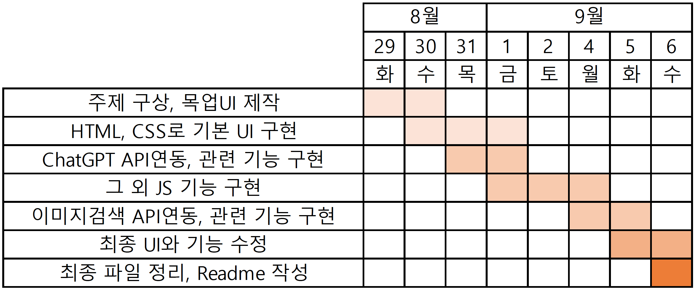

# 오늘의 요리

## 1. 개요

- **오늘의 요리**는 매 식사시간마다 무엇을 요리할 지 고민하는 사람들을 위한 웹사이트 입니다.
- 사용자가 현재 갖고 있는 **식재료들**, 현재 사용 가능한 **조리기구**, 그리고 **식재료 추가 가능 여부**를 입력받아 ChatGPT를 이용하여 현재 만들 수 있는 레시피를 추천해줍니다.

## 2. 개발 환경 및 배포 URL

### 2.1 개발 환경

  

### 2.2 배포 URL

https://haesun-pyeon.github.io/recipe-generator/

## 3. 프로젝트 구조와 개발 일정

### 3.1 프로젝트 구조

```bash
recipe-generator
├── README.md
├── background.jpg
├── common
│   ├── common.css
│   ├── config.js
│   ├── default.jpg
│   └── makeRecipe.js
├── index.html
├── main
│   ├── index.html
│   └── main.js
└── save_list
    ├── index.html
    └── save_list.js
```

### 3.2 개발 일정



## 5. UI

-

## 7. 메인 기능

-

## 8. 추가 기능

-

## 9. 개발하며 느낀점

-
