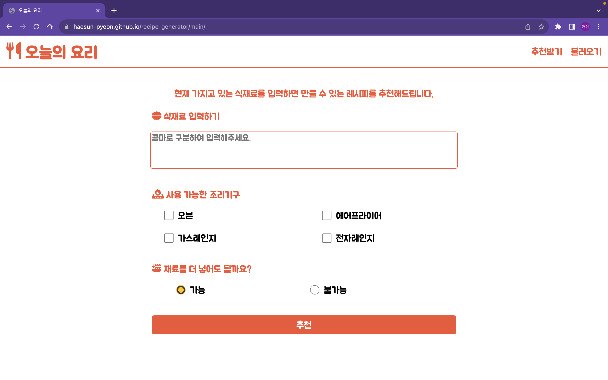
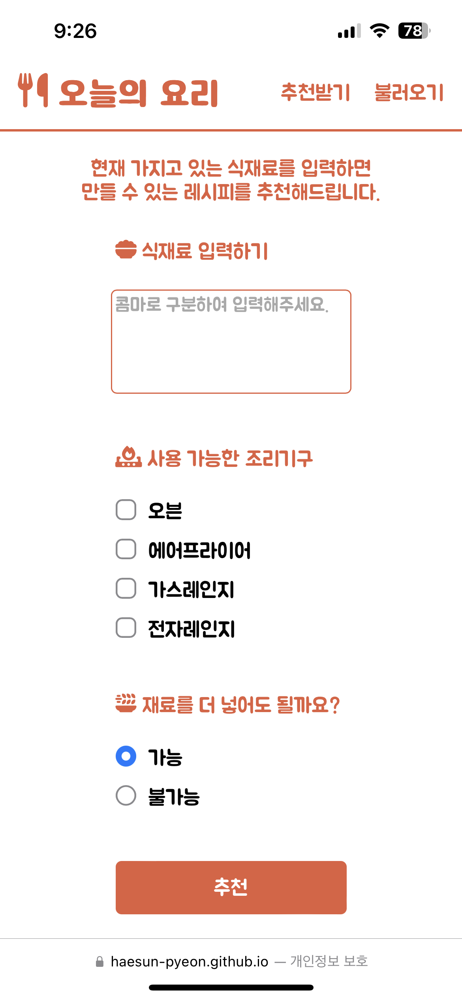
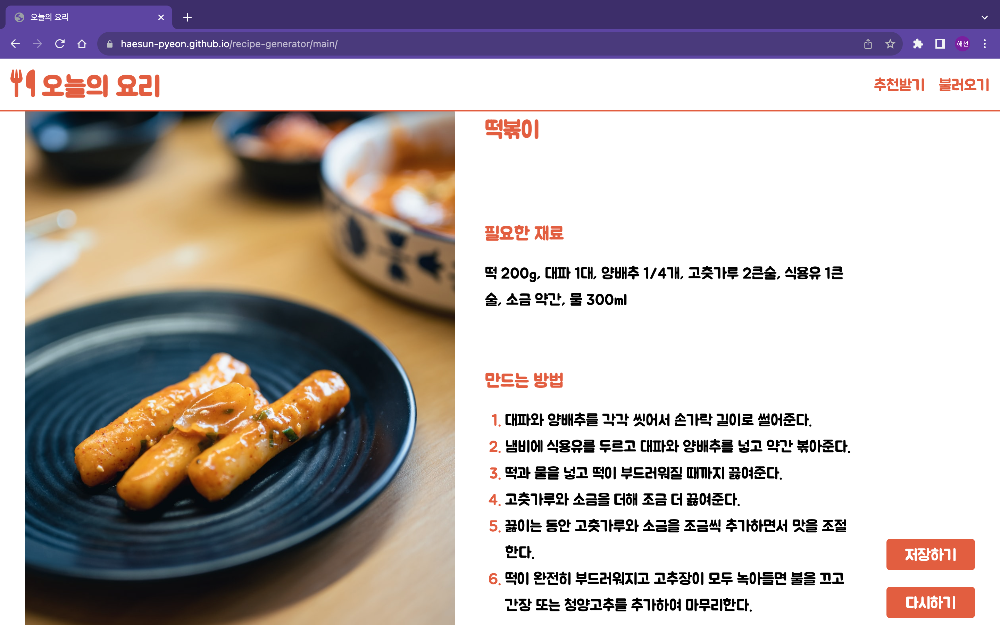
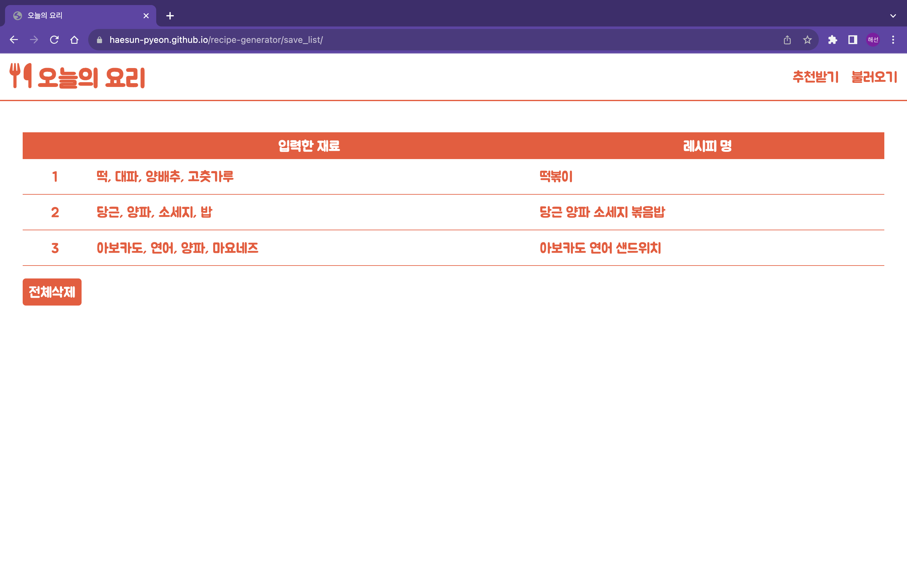
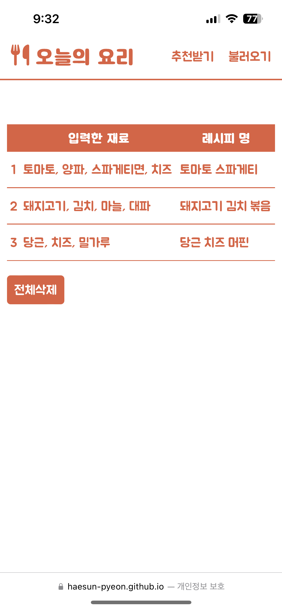

# 오늘의 요리

## 1. 개요

- **오늘의 요리**는 매 식사시간마다 무엇을 요리할 지 고민하는 사람들을 위한 웹사이트 입니다.

- 사용자가 현재 갖고 있는 **식재료들**, 현재 사용 가능한 **조리기구**, 그리고 **식재료 추가 가능 여부**를 입력받아 ChatGPT를 이용하여 현재 만들 수 있는 **레시피를 추천**해줍니다.
  <br><br>

## 2. 사용한 기술스택 및 배포 URL

### 2.1 사용한 기술스택

  

### 2.2 배포 URL

https://haesun-pyeon.github.io/recipe-generator/
<br><br>

## 3. 프로젝트 구조와 개발 일정

### 3-1. 프로젝트 구조

```bash
recipe-generator
├── README.md
├── index.html
├── background.jpg
├── common
│   ├── common.css
│   ├── config.js
│   ├── default.jpg
│   └── makeRecipe.js
├── main
│   ├── index.html
│   └── main.js
└── saveList
    ├── index.html
    └── saveList.js
```

### 3-2. 개발 일정


<br><br>

## 4. UI 및 기능 설명

 

### 4-1. 시작 페이지

- 처음 접속 시 뜨는 시작 페이지입니다. `시작하기`를 누르면 메인 페이지로 연결되고, 헤더의 각 글자들도 누르면 해당 페이지로 연결됩니다.

- 모든 페이지의 폰트, 아이콘, 사진은 모두 무료 & 상업용으로 이용 가능한 배달의민족 주아체, FontAwesome, Unsplash 를 이용하였습니다.

- 모바일에서 접속 시, 작아진 화면에 맞게 반응형으로 크기를 조절하였습니다.

---

 

### 4-2. 메인 페이지

- 레시피를 추천 받기 위해 정보를 입력하는 메인 페이지입니다.

- 현재 가지고 있는 식재료, 사용 가능한 조리기구(중복 선택 가능), 재료 추가여부를 입력받습니다.

- 재료 추가여부에서 `가능`을 선택하면 다른 재료가 더 추가될 수도 있고, `불가능`을 선택하면 입력한 재료 내에서 할 수 있는 요리를 추천해 줍니다.

---

 

### 4-3. 레시피 상세페이지

- ChatGPT가 추천해 준 레시피의 내용을 가공하여 보여줍니다.

- 사진은 Unsplash API를 이용하여 요리 제목과 관련 있는 사진을 검색해서 보여줍니다.

- `저장하기`를 누르면 로컬스토리지에 이 레시피를 저장합니다.

- 이 페이지는 HTML파일이 아닌 2번, 4번 페이지에서 JavaScript로 생성되는 페이지입니다.

---

 

### 4-4. 불러오기 페이지

- 로컬스토리지에 저장했던 레시피들을 불러와서 표 형식으로 보여주는 페이지 입니다.

- 각 행을 클릭하면, 해당 레시피의 상세페이지를 보여줍니다.

- 여기서 상세페이지로 들어가면, 상세페이지 아래 2개의 버튼이 `삭제하기`, `돌아가기`로 바뀌어서 뜹니다.
  <br><br>

## 5. 시연 영상


- 녹화영상을 2배속 하고, 로딩 부분을 자른 후 GIF화 하였습니다.
  <br><br>

## 6. 개발 후기

- 저는 주로 Python을 썼고 JavaScript에는 익숙하지 않아서 배울 때도 문법이 Python과 헷갈릴 때가 많았습니다. 이번 프로젝트를 통해 JavaScript를 많이 써보면서 좀 더 익숙해지는 계기가 되었습니다.

- 이번 프로젝트를 하면서 로컬 스토리지를 이용하여 데이터를 주고받는 방식을 처음 접하게 되었는데 key, value값만 있다 보니 어떻게 저장할지에 대해 여러 방식으로 시도를 해보게 되었습니다. 결국엔 value 값으로 배열을 사용했고 저한테는 배열이 관리하기에 좋다고 느껴졌습니다.

- 함수 모듈화를 한 후, 모듈 함수에서 동적으로 생성된 버튼의 `onclick='함수'`가 JavaScript 파일에 정의되어 있었지만 해당 HTML에 정의되어 있지 않다고 오류가 생겼습니다. 그래서 HTML 하단에 새로 `<script>`태그를 써서 함수를 그곳으로 옮겨 해결했습니다. 다른 방식으로도 가능할 것 같은데 시간상 왠지 쉽게만 해결한 것 같아 좀 더 공부해야겠다는 생각이 들었습니다.
